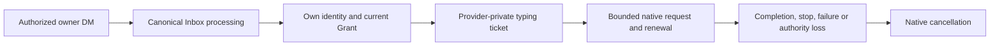

---
{
  "title": "Connect a Bot to personal WeChat",
  "description": "Pair a personal WeChat Bot, bind the owner DM identity and verify replies.",
  "order": 25,
  "source": "docs/wechat-connection.md",
  "sourceRevision": "636a5a6cf4a366bb0b29e6a59155d46fb3cc2192"
}
---

> **Version scope: current-source guide.** These steps include UI updates absent from npm v1.1.0; older test packages and screenshots are historical verification records. See [Connections and optional tools](/docs/capabilities) for release and component boundaries.

The integration accepts text and one file per direct message from the person who scanned the Bot QR code, then lets the PersonaBot reply in the original WeChat Bot conversation. The #904 preview also supports native images as described in section 6. Section 7 describes platform-provided voice transcripts; section 8 describes the #906 original-audio candidate. Section 9 describes the #907 native-video candidate. Section 12 adds explicitly authorized external-only text reports. Groups, other contacts, remote history/search and scheduled-work UI remain separate slices. Enterprise WeChat is a separate integration.

## Before you start

Use the matching BotHarness source-preview product and DSH 0.2.0-rc.1. Create a PersonaBot and confirm a real local DM response. The text slice was verified using local test package `0.0.0-test.878`, with `@botharness/im-provider@4.32.0-botharness.4` built from fork `589e5507d47ab21de5b39c776a598452744a5368`; it is not a published npm release. Source-mode WeChat receive/model/reply has been verified in the native client. The installed package preserved the same connection and records and passed a fresh owner text → canonical Inbox → model → original reply exchange. The Human confirmed `BH878-PACKED-OK` in WeChat. Human QA approved this first slice on 2026-10-06. For source-preview artifact preparation, see [Product IM installation](https://github.com/BotHarness/BotHarness/blob/main/docs/product-im-installation.md).

## 1. Pair the WeChat Bot

Open **Settings → IM bots → WeChat → QR binding**. Start pairing and scan the code using the intended WeChat account. Complete the confirmation in WeChat and wait for the local account to show connected. The resulting conversation is **WeChat ClawBot** in the tested client. Account names may differ; use the conversation created by your actual pairing.

A QR code is a temporary credential. Never place a live code, login URL or account token in a public issue, screenshot or Memory. The initial entry screenshot must omit a usable QR code.

The entry capture precedes pairing and has no independently recorded exact Client hash; it illustrates the setup entry only.

## 2. Bind the PersonaBot identity

Open the PersonaBot DM and, in the **Channel sidebar** on the right, expand **External identities**. Click **+ Bind app** and bind the connected WeChat account. Its row shows the name, its status and an enable switch. Once the row shows **Ready**, DMs from the person who scanned this WeChat Bot go straight to this Bot's Inbox, and the Bot replies in the same DM; other contacts and WeChat groups stay out. You don't authorize the conversation.

_Screenshot shows the earlier Profile layout; binding now lives in the sidebar's External identities entry._

## 3. Manage the owner DM

After the owner's first message, the DM appears under **Active** in the app's conversation list. Use **Mute** to stop it waking the Bot or **Block** to refuse it until **Allow again**. Messages reach only the Bot Inbox; they are not inserted into local Human DM history, and there are no group, mention or topic controls. Replies use the same Bot's bound identity and valid source continuation.

## 4. Check a real text and its reply

In the paired WeChat Bot DM, send a short unique test: `Please use bridge_reply to reply only WECHAT-SETUP-OK in this WeChat DM.` Expand **Bot Inbox**, open the message and confirm the platform is WeChat and the scope is Direct message. When no native nickname was supplied, the UI uses the generic label WeChat user; raw sender/message/source identifiers remain in details.

Check both sides: the Inbox item should become handled and the response should appear in that original WeChat conversation. A provider-accepted record alone is not delivery or read proof. The iLink receipt contains a client-generated acknowledgement ID, not a native server message ID.

The first reply verifies source mode; the second verifies the locally installed package after restart. Neither external test is mirrored into local Human DM history.

## 5. Process a file and return a result

The #903 source-preview candidate uses product `0.0.0-test.903` with managed Provider `4.32.0-botharness.5`; it is not a public npm release. The installed local candidate passed a fresh WeChat file → Inbox → model processing → original-DM file result exchange. The Human downloaded the returned ZIP from WeChat; independent verification confirms its 224 bytes exactly match the model-produced file and its result.txt contains the expected original payload plus the processing marker. The 207-byte input remains unchanged. This verifies that exchange, not native read receipts or every lifecycle failure. The text screenshots above do not prove file support.

Send one file up to 25 MiB in the paired WeChat Bot DM. Open its **Bot Inbox** source details to inspect the original filename and optional declared size. Intake saves metadata; it does not automatically download bytes. A missing native MIME type remains generic rather than guessing from the extension.

This capture shows the received file-source UI. Result receipt was verified separately using the file downloaded from WeChat.

Authorize a dedicated writable Workspace for that PersonaBot before processing. Ask the Bot to save an independent working copy with `bridge_attachment_save`, process it with native tools and approved commands, import the finished file with `channel_attachment_import`, and return it using `bridge_reply_file`. Approve native Tool requests only for the intended work. The original file remains unchanged. File results and text replies share one source reply intent; avoid a preliminary acknowledgement when you want a file result.

Download the returned file in WeChat and inspect its contents independently. A locally accepted send alone does not prove receipt or correct processing. If a declared file exceeds 25 MiB, its metadata stays inspectable but download is refused. Changed identity, revoked authorization, disposed reception or an expired private file ticket also refuses access. Native images, voice and video are not ordinary file intake in this slice.

## 6. View an image and return an image result

The #904 source-preview candidate uses product `0.0.0-test.904.1` and managed Provider `4.32.0-botharness.6`; this is not a public npm release. The original image/model/native-reply path was exercised in candidate `0.0.0-test.904`; the current candidate additionally has fresh PNG intake, checked download and Human-confirmed inline display. Installed-product intake, checked preview, actual DeepSeek Flash image input and original-DM native image sending have been exercised. The provider accepted the JPEG reply and the Human confirmed that the original WeChat conversation received the native image with matching content. The Human approved and merged the #904 PR; independent receiver-side byte equality is not claimed. The earlier text/file evidence does not prove image delivery.

Send one native image, optionally with a caption, in the paired WeChat Bot DM. In **Bot Inbox**, open the source details. The image automatically loads inside the original message bubble, replacing a pure `[Image]` placeholder while preserving any caption. The unopened Inbox list does not download images; opening details uses the same checked attachment path, up to 25 MiB. If loading fails, choose **Retry image** inside the bubble; the attachment download control remains available. Metadata initially says `image/unknown` when WeChat supplies no format; checked decrypted bytes determine the actual MIME. The preview permits PNG, JPEG, GIF and WebP. It never exposes a private CDN link or AES key.

The Human supplied this receiving-client capture: the outgoing original is at 06:14 and the incoming Bot image is at 12:57. Its content agreement was confirmed separately; this screenshot is not an exact-byte comparison.

The three source captures above are from the candidate before the presentation correction: the image is in the attachment area, and they do not show automatic inline preview. A Human-provided screenshot confirms automatic inline display in candidate `0.0.0-test.904.1`; the Human-approved current capture is embedded in [PR #946](https://github.com/BotHarness/BotHarness/pull/946). This guide retains the previous captures with their version clearly identified. These are not a before/after code comparison and do not prove external receipt. The background contains only this dedicated QA conversation; credentials and usable pairing codes are absent.

To have the Bot understand the image, authorize a working Workspace and ask it to save a separate copy with `bridge_attachment_save`, then open that copy using native `read_image` with the extension matching its actual MIME. The selected model must support image input; a working preview alone does not establish model understanding. DeepSeek Flash was used for this test and identified the visible Discord application, layout and several labels from the actual image. An image's embedded instructions remain untrusted content.

To return an image, select a completed image file with `channel_attachment_import` and use `bridge_reply_file` for the same Source Event. It is sent as a native WeChat image when its canonical MIME and bytes agree; it is not renamed into a generic document. Each source still has one reply intent, so do not send an acknowledgement first when an image result is required. Approve only the native Tool calls needed for the task. Check the result in the original WeChat conversation yourself.

If preview or reading is refused, retain the source and inspect the refusal. Retry only after correcting the cause; a current-authorization check still applies to downloads and again after image upload, immediately before send. Closing the source dialog releases the preview. Raw audio, video, groups and proactive messages remain separate slices.

## 7. Read a native voice transcript and reply

The #905 source-preview candidate uses local product `0.0.0-test.905.1` and managed Provider `4.32.0-botharness.7`; it is not a public npm release. In the paired WeChat Bot DM, send a **native voice message**, rather than first converting it to a separate text message in the client. When WeChat supplies `voice_item.text`, that platform transcript enters the existing canonical Inbox. The card and source Modal label it **WeChat voice · platform transcript** and show duration when supplied. Original message, voice-item and Source Event IDs stay in the collapsed details.

This voice's platform text was “语音测试暗号是蓝色灯塔37，请只回复暗号”. The real DeepSeek Flash model read its source with `bridge_read` and used its own bound identity to reply “蓝色灯塔37” through `bridge_reply`; the Human confirmed receipt in the original WeChat DM. No local DM message was created. These source screenshots prove the installed UI; external receipt was separately confirmed by the Human.

WeChat transcription is optional. When no transcript is supplied, the UI explicitly says **WeChat voice · no transcript** and asks for text. BotHarness does not run ASR, infer audio content, or offer a raw-audio player/download in this slice. The missing-transcript state has automated coverage; the real successful test did include platform text. Native transcription can change number formatting or words, so verify the displayed text before acting on it. Partial/generating and ambiguous multi-item messages are outside this candidate.

## 8. Download original voice or prepare playback

The #906 candidate (`0.0.0-test.906.3`, managed Provider `4.32.0-botharness.8`) retains platform text and original audio separately; it is not a public npm release. Open the native voice Source Modal. When the Provider has readable audio, **Download original voice** retrieves the unchanged original. Native codec, sample rate and bit depth appear in collapsed message details only when WeChat actually supplies them; missing fields are not inferred.

Choose **Prepare playback** to create a separate WAV for supported SILK input and reveal an audio player. The fresh iLink test reported codec identifier `4` but carried a valid Tencent SILK header; playback accepts observed identifiers `4` and `6` only after checking the actual SILK packets, and preserves the reported value. This is not support for arbitrary codec-4 files. The converted file is mono, 24 kHz, 16-bit PCM; these are output properties, not the native recording's inferred sample rate. Closing the Modal cancels preparation and releases playback resources; reopening requires selecting playback again. Unsupported codec, failed decoding or processing-limit refusal leaves original download available. Original downloads have the existing 25 MiB bound. Playback preparation limits input to 1 MiB, packet count to 6,000, decoding time to 10 seconds and PCM output to 12 MiB.

With a writable Workspace Grant, the Bot can use `bridge_attachment_save` with `representation: playback` to save an independent `voice.wav` working copy, then process that file using authorized native tools. Omit that field to save the unchanged original. Normal native Tool approval still applies, and another Bot's identity is never borrowed. After actual processing, `bridge_reply` can send text to the original DM. Saving, playing or inspecting a file is not speech understanding: this connection adds no ASR, automatic audio-model input or native voice reply. Without platform text or a separately configured and verified audio-understanding route, ask for text.

The installed #906 candidate has completed a fresh paired-owner test: native voice → Bot Inbox → unchanged original through the checked download endpoint → separate WAV → authorized Workspace copy → approved native Python file inspection → `BH906-AUDIO-OK` in the original WeChat DM, confirmed by the receiving Human. The Bot inspected the actual file as mono, 16-bit, 24 kHz PCM with 179,040 frames (7.46 seconds) and wrote a JSON result. The Workspace copy and checked WAV have identical bytes. This proves audio file processing, not speech understanding. The voice also carried a platform transcript; transcript-free intake and refusal paths have automated coverage, not a separate real receiving-side test.

The browser player reached the actual end without a media error; closing removed the player and reopening required explicit preparation again. Original-byte download was independently verified through the authenticated endpoint; the browser automation did not report a completed file-download event, so a browser-saved original file is not claimed. Automated coverage also includes real SILK encoding/decoding, unchanged original bytes, cached restart, cancellation, codec refusal and authorization revocation. #905 transcript success does not substitute for these raw-audio checks.

## 9. Receive a native video and return a video result

The #907 local candidate uses product `0.0.0-test.907.4` and managed Provider `4.32.0-botharness.9`; it is not a public npm release. Real native-video intake, checked download, browser playback and model file processing have been verified. The Provider accepted the resulting native-video reply in the original DM; the Human confirmed native receipt, and the receiving-client screenshot shows the matching fixture with a three-second duration. Independent receiver-side downloaded-byte equality is not claimed.

Send one **native video** in the paired WeChat Bot DM, rather than attaching it as an ordinary document. Intake retains an opaque attachment reference and the native video item's available metadata in the canonical Source Event. The reported `video_size` is retained as `reportedSizeBytes`. Its meaning can differ between incoming and outgoing messages: the tested incoming value matched the decrypted MP4 length, while the official sending implementation supplies encrypted length. It is not treated as a guaranteed decrypted or encrypted size; checked downloaded bytes determine actual file size. The optional `play_length` is retained without assuming its time unit. Missing dimensions, duration, thumbnail and codec are not invented. Private CDN locations, encryption keys and conversation continuation tokens remain outside model-readable source data.

Open the video source in **Bot Inbox**. The original video is retrieved and shown directly in the message bubble through the existing current-identity/current-authorization checked attachment path, up to 25 MiB. The player is offered for conservatively recognized MP4 bytes; actual playback depends on browser codec support. It does not auto-play. A video-only message no longer repeats `[Video]`; captions remain visible. A failed preview offers **Retry playback** and retains **Download file**. Closing the Modal cancels the request and releases the playback resource. This candidate adds playback to the source Modal; it does not add media rendering to Channel message history or mirror Inbox-only traffic into a local DM.

These captures use the installed candidate after integration with main `fe177d46`. The five-second H.264 fixture arrived through real WeChat intake; its checked 239,132 bytes exactly match the sent fixture. Native browser playback reached the end without a media error, and reopening reset the player without autoplay. These UI captures do not prove external result delivery.

For actual processing, authorize a writable Workspace for that PersonaBot. The Bot saves an independent copy using `bridge_attachment_save`, then processes that selected file with native tools and normal approval. Import the completed MP4 with `channel_attachment_import` and reply to the same Source Event using `bridge_reply_file`. A checked WeChat Provider sends the matching MP4 as a native video using that Bot's own bound identity. Video upload and the final send recheck the current authorization. Each Source Event has one reply intent: do not acknowledge first if a video result is required.

In the real QA run, the Bot saved the original into an explicitly authorized isolated Workspace and, after once-only native Tool approvals, produced the first three seconds using ffmpeg. Independent inspection confirmed a 204,644-byte, three-second H.264 result and an unchanged input. The Bot imported that result and sent it using its own identity; the Provider accepted the reply. This is file processing, not semantic video understanding.

Inspect the returned video in the original WeChat conversation and independently verify its actual contents. Tool processing, a working browser player, or Provider acceptance alone is not model video understanding, recipient delivery, a read receipt or byte equality. Unsupported formats retain original-download or refusal paths; this slice does not add arbitrary video transcoding or automatic video-model input.

## 10. Quote a message and read retained context

In WeChat, use **Quote** on a message in the paired-owner private conversation, then write your follow-up. Open that source from the PersonaBot's Inbox in BotHarness. The quoted block distinguishes **Quote supplied by WeChat**, **Quote found in retained local records**, and **Quoted content unavailable**. Expand **Quote details** to inspect native IDs and any resolved Source Event.

WeChat can provide embedded quoted text, a display summary, an item ID, a server message ID, or partial-quote metadata. A summary is not promoted to the original body; item IDs stay separate from server message IDs. When WeChat omits the body, BotHarness resolves a genuine server message ID only from readable canonical records in the same currently authorized account/private conversation. An unknown, unretained or inaccessible reference stays unavailable; this does not prove that the original was deleted. Quoted attachments are not automatically fetched. A quote never creates a Thread.

Ask the Bot to read **retained local context** when needed. `bridge_context` uses `retained` for the latest retained sources (newest first), or `retained-nearby` for up to 10 preceding / 5 following retained sources around the anchor, excluding the anchor; the Bot may request 0–20 on either side. Every result keeps the native Message ID and canonical Source Event ID. These records cover only what this Bot can currently read locally, not remote WeChat history or search; the nearby counts do not promise a five-minute remote window.

Reads return at most 20 records per page and obey a JSON budget (1,000–24,000 characters, default 12,000). Follow `nextCursor` with the same source, scope and counts. The cursor fixes the initial record boundary, so later arrivals are excluded; it expires after 30 minutes or a Host restart. A changed Grant/identity or revoked authorization refuses continuation. If a single record exceeds the budget, `requiredCharacters` indicates the budget needed. Reading context creates no new Inbox delivery, wake, subscription, local DM or external send. The source panel shows the Bot's read audit and latest page.

WeChat reply receipts remain client acknowledgements. They cannot be used to resolve a server-message-ID-only quote of a Bot reply. Embedded native quoted text can still be shown; without that text or a genuine retained server ID, the quote remains unavailable. Section 12 separately preserves native server IDs returned by proactive reports.

The #908 live test received an item-ID-only quote: WeChat supplied neither the quoted body nor a server message ID. BotHarness kept the quote explicitly unavailable. The Bot read the original canonical Source Event through two retained-context pages and one nearby query, then sent `BH908-QUOTE-OK 紫色风铃42` to the same authorized private conversation. The Provider accepted the send, and the Human confirmed receipt with a native WeChat screenshot. Embedded-body and server-ID resolution variants are covered by regressions, not claimed as live-tested client variants.

## 11. Share a private source through a local Channel

The #909 installed-product test used `0.0.0-test.909.2` with the unchanged Provider `4.32.0-botharness.10`. One paired-owner conversation delivered the same canonical Source Event to a local shared Group and the receiving Bot's separate Inbox. The Human confirmed all four original-WeChat replies.

Keep the receiving PersonaBot's WeChat app bound. Create a local Group with this Bot and its collaborators. Adding a new sync is being redesigned around **External connectors**; an existing sync keeps working, and its name or pause state is edited there. The fixed condition is **Paired-owner DM messages**: there are no mention or topic controls. A local Group is not a native WeChat group.

Each Group member chooses its own Channel message policy: process each message, harvest by count/time, or receive silently. In the live test, the receiver processed its Inbox immediately while a collaborator waited for two shared messages. The collaborator used `bridge_read` to inspect both real sources and replied locally with `channel_send`. That Bot had no WeChat identity or Grant. Reading shared text does not lend the receiver's external identity: external replies, context and attachment access still require the acting Bot's own valid binding and Grant.

The receiver can retain a separate Inbox-only path governed by its private-message policy. Inbox-only adds no Human DM history; only an explicit local DM destination displays the source there. Local DM routing, duplicate input, connector deletion and receiver departure are regression-tested; this live run qualified the shared Group plus Inbox-only combination.

Switch-off preserves history and stops future placements for this route while other enabled destinations continue. In the live test, the paused message reached only the receiver's Inbox and was answered in WeChat. Resume plus a same-Profile restart preserved message IDs and settings without backfilling that message. A new postrestart message reached the shared Channel and was processed by the reader's changed **Every message** policy. Delete keeps accepted history; receiver departure stops new routing there. Identity, target authorization and connector switches have separate scopes.

This short sampled browser recording shows the real connector switch and saved status changes; native WeChat receipt is established by the live messages and Human confirmations above.

<video controls preload="none" playsinline poster="/guides/wechat/routing-profile-light.jpg" style="width:100%;max-height:640px">
<source src="/guides/wechat/routing-switch-demo.mp4" type="video/mp4" />
</video>

[Download the connector-switch recording](/guides/wechat/routing-switch-demo.mp4)

## 12. Send an external-only text report

Keep the PersonaBot's own enabled WeChat identity. Until the Provider lists WeChat conversations for proactive posts, reports use the advanced fallback: in the Bot DM sidebar, open **External connectors → Save a send target (advanced)** and save the QR-paired owner DM. A qualified Provider exposes **Message → Send message**. Write a unique report and send explicitly. It creates a canonical Outbox report in WeChat only, without a local Human DM mirror or new Inbox Admission. The Bot can use the same capability through `bridge_targets`, `bridge_post` and `bridge_outbox`. This adds no scheduler.

_Screenshots show the earlier Profile layout; the saved send target now lives in the sidebar's External connectors → Save a send target (advanced)._

The paired owner first sends a message in the original WeChat conversation while this Bot's authorized intake is running. Private context stays inside the Provider and is never renewed by synthetic heartbeats. A local retention ceiling does not promise server validity. Missing context or native rejection fails with recovery instructions: check identity/authorization/intake, send a fresh message in the same DM, then explicitly request a new report. Re-pairing needs new authorization; another contact cannot substitute for this conversation.

Open **Recent sends** to inspect report content and outcome. **Platform accepted** proves neither recipient delivery nor reading. **Origin details** separates the client acknowledgement from a genuine native server message ID actually returned; absent server IDs remain unavailable. Inspect an uncertain outcome with the same request ID rather than blindly resending. Revocation or changed/disabled identity refuses new sends; old Outbox records remain inspectable.

The #910 final UI candidate is locally packed product `0.0.0-test.910.1` / managed Provider `4.32.0-botharness.12`, fork `4f4f0a6282580bb59968eb90571778eb7e37ee73` on DSH `0.2.0-rc.1`. A fresh-computer Human pairing produced a real missing-context refusal; fresh owner intake restored posting. The Human confirmed `BH910-PROACTIVE-OWNER-0632` in WeChat, and `910 FOLLOWUP 蓝色灯塔63` entered the same canonical Inbox. Profile posting left local DM history unchanged. The preceding packed build `0.0.0-test.910` used a real model to post `BH910-MODEL-POST-0640`; Provider acceptance and independent Human receipt are both confirmed. Final UI recapture and restart preserved both reports and the Inbox. Observed server IDs do not promise every response supplies one. The Human supplied a native screenshot showing both reports and the follow-up; it is delivery evidence, not a read receipt. Public release and deployment remain separate.

The recording shows real Profile input, send, Outbox settlement and receipt inspection. It proves browser behavior; recipient receipt comes from the independent Human check.

<video controls preload="none" playsinline poster="/guides/wechat/proactive-after-light.jpg" style="width:100%;max-height:640px">
<source src="/guides/wechat/proactive-send-demo.mp4" type="video/mp4" />
</video>

[Download the proactive-send recording](/guides/wechat/proactive-send-demo.mp4)

## 13. Request native typing while the Bot works

The #911 preview candidate connects native typing to the canonical Bot processing lifecycle. In Windows packaged candidate `.911.7`, the Human confirmed native typing during private-message, related Assignment and follow-up processing, and no indicator during actual work with the preference off. Genuine native pwsh waits and final replies were verified. The Human confirmed cleanup after failure, native Session cancellation, Binding disablement, Grant revocation, Provider disposal and a Windows Host interruption/restart. Fresh-message recovery passed after revocation and restart. The subsequent main integration uses candidate `.911.8` and a fresh Profile; its native requalification remains pending. See the [Windows verification record](https://github.com/BotHarness/BotHarness/blob/main/docs/qa/wechat-911-windows-handoff.md) for evidence and limits; this is still a Draft candidate awaiting final Human QA and artifact promotion.

Open **PersonaBot DM → Channel sidebar → External identities → Edit** for the bound WeChat identity. **Native WeChat typing status** defaults to on; turn it off to suppress requests for that identity. The preference survives restart. A Provider lacking the checked capability is shown as unavailable, even when the preference is on. Global defaults and Profile inheritance belong to #912.

Only actual processing of a currently authorized paired-owner DM requests typing. Related Orchestrator and Assignment work share the lifecycle; unrelated local Channel work does not borrow the WeChat identity. Queued follow-ups wait for acceptance. Requests renew no more frequently than every five seconds and end after ten minutes at most, even if work continues.

**Request accepted** reports API acceptance, not visible client typing, delivery or reading. **Typing request did not succeed** means processing can continue without typing. **Typing cleanup is unconfirmed** means cancellation could not be confirmed; do not describe it as successful cleanup or promise an undocumented server expiry. Turning the identity off or revoking its authorization cancels active leases; restart begins idle and never restores a saved indicator.

For real verification, send a unique controlled request in the paired WeChat DM, observe the native typing indicator during actual work, and capture its disappearance after completion and a stopped/failed run. The Human operates WeChat and records those observations; Host logs alone cannot satisfy this check. Native tickets, pairing codes and unrelated chats stay out of evidence. See [#911](https://github.com/BotHarness/BotHarness/issues/911) for the qualification record.

## Pause or reconnect

Mute the DM to stop it waking the Bot, or Block it to refuse future messages, while retaining history. Unbind the app to remove its authority. Re-pairing changes the identity fingerprint and needs a new binding; stale source continuations must not be reused. Restart with the same Profile to retain local pairing, canonical source records and Outbox outcomes.

If text does not arrive, check the connected account, the enabled identity and whether the owner DM is muted or blocked. Messages from other contacts and groups remain unsupported. This candidate supports owner text, files, qualified images and platform voice transcripts; section 8 describes the separately qualified original-audio candidate. Section 9 describes the separately qualified native-video candidate; its real native intake, processing and Human-confirmed original-DM video receipt are verified. If a reply is refused because its original continuation expired or is absent, send a new text in the paired conversation; the Bot must not borrow another conversation. An unknown send outcome must not be blindly resent.

## Verification and scope

[#878](https://github.com/BotHarness/BotHarness/issues/878) records source and installed-product qualification. The installed-product test retained the same paired identity and owner-DM Grant across restart, then produced one handled canonical Admission, one successful model `bridge_reply`, one accepted Outbox result and the visible `BH878-PACKED-OK` reply. The Human provided the native screenshot and approved publication.

The setup, identity and Inbox images show real source-mode QA states; the native screenshot shows both source and installed-product exchanges. Final Profile recapture was unavailable because the Human retained direct UI control; use the setup steps above to inspect the current controls. No screenshot contains a live pairing code, credentials or unrelated private chat lists. Rebind, duplicate, wrong-route and revoke refusal are regression-tested; a complete live failure/lifecycle matrix is not claimed. Public npm release and site deployment are separate actions.
