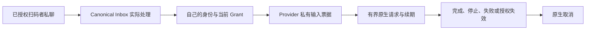

---
{
  "title": "连接个人微信",
  "description": "扫码连接个人微信 Bot、绑定扫码者私聊身份，并核对回复。",
  "order": 25,
  "source": "docs/wechat-connection.zh.md",
  "sourceRevision": "636a5a6cf4a366bb0b29e6a59155d46fb3cc2192"
}
---

> **版本范围：当前源码教程。** 下列步骤包含尚未进入 npm v1.1.0 的界面更新；文中的旧测试包版本和截图属于历史验证记录。正式版与可选组件的区别见[接入与可选能力](/docs/capabilities)。

接入支持扫码者在微信 Bot 私聊发送文字或单个文件，消息进入 PersonaBot 的 Inbox，由 Bot 使用自己的绑定身份回复原微信私聊。#904 预览另外支持第 6 节说明的原生图片。第 7 节说明微信平台语音转写，第 8 节说明 #906 原始音频候选。第 9 节说明 #907 原生视频候选。第 12 节增加显式授权的纯外部主动文字报告。群消息、其他联系人、远端历史／搜索及定时任务 UI 仍属于独立切片。企业微信是另一种接入方式。

## 开始前

使用对应的 BotHarness 源码预览产品及 DSH `0.2.0-rc.1`。先创建 PersonaBot，确认它能真实回复本地 DM。文本切片验收使用的本机测试产品为 `0.0.0-test.878`，Provider 为 `@botharness/im-provider@4.32.0-botharness.4`，输入固定为 fork `589e5507d47ab21de5b39c776a598452744a5368`；这不是已发布的 npm 产品。源码版已在微信客户端验证收件、模型与回复；压缩包安装后保留了连接及记录，并通过新一轮扫码者文字 → canonical Inbox → 模型 → 原私聊回复验证；Human 已确认微信收到 `BH878-PACKED-OK`。Human 于 2026-10-06 验收了首个切片。源码预览产物准备见[产品 IM 安装](https://github.com/BotHarness/BotHarness/blob/main/docs/product-im-installation.md)。

## 1. 扫码绑定微信 Bot

打开 **设置 → IM bots → 微信 → 扫码绑定**，开始绑定后，用目标微信账号扫码并在微信中确认。等待本地账号显示已连接。本轮客户端里的会话名是 **微信 ClawBot**；不同账号可能有所差异，请使用实际扫码创建的会话。

二维码是临时凭据。不要在公开 issue、截图或 Memory 中放入有效二维码、登录链接或账号令牌。接入入口截图应省略可用二维码。

入口截图来自配对前，未独立记录准确的 Client hash，仅用于说明入口。

## 2. 绑定 PersonaBot 的外部身份

打开 PersonaBot 的 DM，在右侧 **Channel sidebar** 展开 **外部身份**，点击 **+ 绑定应用**，绑定已连接的微信账号；行内显示名称、状态及启用开关。身份行显示「已就绪」后，扫码者本人私聊这个微信 Bot 的消息会直接进入这个 Bot 的收件箱，Bot 在原私聊回复；其他联系人和微信群的消息不会进入。不需要授权会话。

_图片为旧版 Profile 布局；现在绑定位于右侧侧栏的「外部身份」。_

## 3. 管理扫码者私聊

扫码者发出第一条消息后，这个私聊会出现在应用会话列表的 **活跃** 中。用 **静音** 让它不再唤醒 Bot，或用 **屏蔽** 拒绝它，直到点击 **再次允许**。消息只进入 Bot 收件箱，不会加入本地 Human DM 历史，也没有群收件、@ 或话题设置。对外回复使用当前 Bot 自己的绑定身份及有效的原消息续接能力。

## 4. 核对真实文字与原私聊回复

在绑定的微信 Bot 私聊发送唯一测试文字，例如：`请通过 bridge_reply 在此微信私聊只回复 WECHAT-SETUP-OK。` 展开 **Bot 收件箱**，打开来源详情，确认平台为微信、范围为私聊。微信未提供昵称时，界面使用通用的“微信用户”标签；原始发送人、消息和 Source Event ID 保留在详情里。

两侧都需要核对：Inbox 状态变成已处理，并且回复出现在原微信私聊。仅有“平台已接受”不能证明送达或已读。iLink 回执里的 ID 是客户端生成的确认标识，不是已证明的原生服务端消息 ID。

第一条回复验证源码版，第二条验证重启后的本机安装产品；两次外部测试均未镜像进本地 Human DM。

## 5. 处理文件并回传结果

#903 源码预览候选使用产品 `0.0.0-test.903` 和托管 Provider `4.32.0-botharness.5`，不是公开 npm 发布；本机安装候选已通过新一轮微信文件 → Inbox → 模型处理 → 原私聊结果文件的真实验收。Human 从微信下载返回 ZIP 后，独立核对确认 224 字节与模型生成文件完全一致，result.txt 包含预期原始内容和处理标记；207 字节原始输入保持不变。这证明本次往返，不代表原生已读或所有生命周期异常均已验证。上面的文字截图不能证明文件能力。

在配对的微信 Bot 私聊发送一个不超过 25 MiB 的文件。打开 **Bot 收件箱** 的来源详情，可查看原始文件名和平台提供的声明大小。收件只保存元数据，不会自动下载字节；原生 MIME 缺失时显示通用类型，不根据扩展名伪造类型。

这张截图呈现收到文件后的来源 UI；结果收取通过微信下载文件另行核对。

处理前，为此 PersonaBot 授权专用的可写工作区。让 Bot 使用 `bridge_attachment_save` 保存独立工作副本，通过原生工具和已批准的命令处理，再用 `channel_attachment_import` 导入完成文件，最后通过 `bridge_reply_file` 回到原微信私聊。只批准目标工作所需的原生工具请求。原文件保留不变；文件结果与文字回复共用一次来源回复意图，需要回传文件时不要先发送文字确认。

在微信下载返回文件，独立核对内容。本地平台接受记录不能单独证明收到文件或处理正确。声明超过 25 MiB 的文件仍能查看元数据，但下载会被拒绝。身份变化、授权撤销、收件释放或私有文件票据过期也会拒绝访问。此切片不会把原生图片、语音、视频当作普通文件收件。

## 6. 查看图片并回传图片结果

#904 源码预览候选使用产品 `0.0.0-test.904.1` 和托管 Provider `4.32.0-botharness.6`，不是公开 npm 发布。原始图片／模型／原生回传链路在候选 `0.0.0-test.904` 验证；当前候选额外完成了新 PNG 收件、checked 下载，以及 Human 确认的气泡内展示。本机安装产品已验证收件、checked 预览、DeepSeek Flash 真实图片输入，以及回原私聊的原生图片发送；平台接受了 JPEG 回复，Human 确认原微信会话收到原生图片、内容一致；Human 已批准并合并 #904 PR；未宣称接收端独立字节校验。前面的文字／文件证据不能证明图片送达。

在绑定的微信 Bot 私聊发送一张原生图片，可带说明文字。打开 **Bot 收件箱** 的来源详情后，图片会自动加载到原消息气泡中，替代纯图片消息的 `[Image]` 占位，说明文字仍保留。不打开详情时不会下载图片；打开后通过既有 checked 附件路径下载，最大 25 MiB。加载失败时，可在气泡内选择 **重新加载图片**；附件的下载入口仍保留。微信未提供具体格式时，初始元数据为 `image/unknown`；对解密后的真实字节检查才确定 MIME。预览支持 PNG、JPEG、GIF 和 WebP，不暴露私有 CDN 链接或 AES 密钥。

Human 提供的接收端截图显示：06:14 发出原图，12:57 收到 Bot 的原生图片；内容一致另由 Human 确认，此截图不代表字节级比较。

上面三张来源截图来自调整前的安装候选：图片位于附件区，尚未体现自动在气泡内加载的展示修正；Human 提供的截图已确认新候选 `0.0.0-test.904.1` 自动在气泡内展示图片；经 Human 明确授权公开的当前截图已嵌入 [PR #946](https://github.com/BotHarness/BotHarness/pull/946)。本指南保留此前截图，并明确标注其对应版本。这些截图不是代码改动前后对照，也不证明外部接收。背景只有专用 QA 对话，不包含凭据或可用配对码。

让 Bot 理解图片时，先授权工作区，使用 `bridge_attachment_save` 保存独立副本，再通过原生 `read_image` 打开与真实 MIME 扩展名一致的副本。所选模型必须支持图片输入；能预览不能证明模型理解。本次使用 DeepSeek Flash，它从真实图片识别了 Discord 应用、布局和多处文字。图片中嵌入的指令仍是不可信内容。

回传图片时，通过 `channel_attachment_import` 选定完成的图片文件，再对同一个 Source Event 调用 `bridge_reply_file`。canonical MIME 与实际字节一致时会发送为微信原生图片，不会只是把文件改名成普通文档。每个来源仍只有一次回复意图，需要图片结果时不要先发文字确认。仅批准任务需要的原生工具调用，并亲自在原微信会话核对收到的图片。

预览或读取被拒绝时，保留来源并检查原因，修复后再重试。下载继续检查当前授权；图片上传后、最终发送前也会再检查一次。关闭来源弹窗会释放预览。原始音频、视频、群和主动消息仍是后续独立切片。

## 7. 读取微信原生语音转写并回复

#905 源码预览候选使用本机产品 `0.0.0-test.905.1` 和托管 Provider `4.32.0-botharness.7`，不是公开 npm 发布。在绑定的微信 Bot 私聊发送一条**原生语音**，无需先在微信客户端转换成另一条文字消息。微信提供 `voice_item.text` 时，平台转写进入现有 canonical Inbox。来源卡片和弹窗显示**微信语音 · 平台转写**，平台提供时长时一并展示。原始消息、语音项与 Source Event ID 保留在折叠详情中。

这条语音的平台转写为“语音测试暗号是蓝色灯塔37，请只回复暗号”。真实 DeepSeek Flash 模型使用 `bridge_read` 核对来源，再以自己的绑定身份通过 `bridge_reply` 回复“蓝色灯塔37”；Human 确认原微信私聊收到回复，没有产生本地 DM 消息。来源截图证明安装后的 UI，外部实际收取另由 Human 核对。

微信不保证提供转写。缺失时，界面明确显示**微信语音 · 未提供转写**并提示改发文字；BotHarness 不自行实现 ASR、不猜测音频内容，此切片也不提供原始音频播放器／下载。缺失状态有自动回归覆盖，但本次真实成功测试包含平台转写。原生转写可能改变数字格式或词语，执行任务前应核对显示文本。未完成／生成中的语音及多项歧义消息不属于此候选。

## 8. 下载原始语音或准备播放

#906 候选（`0.0.0-test.906.3`，托管 Provider `4.32.0-botharness.8`）分别保存平台转写文本与原始音频；这不是公开 npm 发布。打开原生语音的外部消息弹窗，若 Provider 提供可读取的音频，点击「下载原始语音」会取得未转换的原文件。原生编码、采样率和位深只在微信确实提供时显示在折叠的消息详情中；没有这些字段时不会猜测。

点击「准备播放」会为支持的 SILK 原文件生成独立 WAV，随后显示播放器。新 iLink 实测上报编码值 `4`，文件却带有有效的腾讯 SILK 文件头；候选仅在校验实际 SILK 包后接受已观察的 `4`／`6`，并保留原字段。这不代表支持任意编码值为 `4` 的文件。转换后固定为单声道、24 kHz、16 bit PCM；这些是播放文件的格式，不代表原语音的采样率。弹窗关闭后会取消准备并释放播放器资源，再次打开时需重新选择播放。编码不支持、解码失败或超过处理限制时，弹窗会提示原因范围，原文件仍可下载。原文件下载上限为 25 MiB；播放准备要求输入不超过 1 MiB、最多 6,000 个语音包，解码时间不超过 10 秒，输出 PCM 不超过 12 MiB。

Bot 可在已有可写工作区授权下，用 `bridge_attachment_save` 的 `representation: playback` 保存独立 `voice.wav` 工作副本，再通过已授权的原生文件工具处理它。不指定该字段时保存未转换的原文件。原生工具仍需正常审批，不会借用别的 Bot 身份；实际完成后，可用 `bridge_reply` 在原私聊回复文字。保存、播放或检查音频文件不等于理解语音内容：这项接入不新增 ASR、不自动把音频送给模型，也不发送原生语音。微信未提供转写时，若没有另行配置且经过验证的音频理解能力，仍应请用户补发文字。

安装形态的 #906 候选已完成新一轮扫码者真实验收：原生语音 → Bot 收件箱 → checked 下载端点取得未转换原文件 → 独立 WAV → 已授权工作区副本 → 批准后的原生 Python 文件检查 → 在原微信私聊回复 `BH906-AUDIO-OK`，接收方 Human 已确认收到。Bot 实际检查出单声道、16 bit、24 kHz PCM、179,040 帧（7.46 秒），并写入 JSON 结果；工作区副本与 checked WAV 字节完全一致。这证明音频文件处理，不代表理解语音内容。该语音同时带有平台转写；无转写收件与拒绝路径有自动化覆盖，未另行宣称真实接收端验收。

浏览器播放器已到达实际播放终点，没有媒体错误；关闭后播放器移除，再打开需显式准备。原文件字节通过已认证下载端点独立核对；浏览器自动化未报告完成的文件下载事件，因此未宣称浏览器已保存原文件。自动化覆盖还包括真实 SILK 编解码、原文件保持不变、缓存与重启、取消、编码拒绝和撤销授权。#905 的转写成功不能代替这些原始音频验证。

## 9. 接收原生视频并回传视频结果

#907 本机候选使用产品 `0.0.0-test.907.4` 与受管理 Provider `4.32.0-botharness.9`，并非公开 npm 版本。真实原生视频收件、已核对下载、浏览器播放和模型文件处理已验证。Provider 已接受沿原私聊发送的原生视频结果；Human 已确认收到原生视频，接收端截图呈现相同测试画面与三秒时长；未宣称从接收端下载后的字节完全一致。

在配对的微信 Bot 私聊发送一条**原生视频**，不要作为普通文档附件发送。收件将不透明附件引用及原生视频项提供的元数据保留在 canonical Source Event 中。平台的 `video_size` 保留为 `reportedSizeBytes`：此次收件值与解密后的 MP4 大小一致，而官方发送实现填写加密大小，不能假设收件和发件语义相同。实际大小按已核对的下载字节数判断；可选 `play_length` 保留原值，不猜测时间单位。不编造缺失的画面尺寸、时长、缩略图或编码。私有 CDN 地址、密钥和会话续接令牌不会暴露给模型。

在 **Bot 收件箱**打开视频来源，视频会沿用当前身份／当前授权的附件读取路径，直接显示在消息气泡中，原件上限为 25 MiB。经过保守字节识别的 MP4 可显示播放器，实际能否播放取决于浏览器编码支持，不会自动播放。只有视频时不再重复显示 `[Video]`，有正文时保留正文。播放失败时可选择**重试播放**，并保留**下载文件**。关闭弹窗会取消读取并释放播放资源。这一候选只补来源弹窗的播放，不补 Channel 消息历史媒体渲染，也不把 Inbox-only 信息镜像进本地 DM。

截图来自合入 main `fe177d46` 后的安装候选。五秒 H.264 测试视频经过真实微信收件，已核对的 239,132 字节与发送原件完全一致。浏览器原生播放到结尾且无媒体错误，重新打开恢复到未播放状态，不会自动播放。这些界面截图不能证明外部结果送达。

实际处理前，为此 PersonaBot 授权可写工作区。Bot 使用 `bridge_attachment_save` 保存独立副本，经过正常审批，用原生工具处理选定文件。用 `channel_attachment_import` 导入完成的 MP4，再通过 `bridge_reply_file` 回应同一个 Source Event。合格的微信 Provider 将匹配的 MP4 作为原生视频发送，使用此 Bot 自己的绑定身份；上传后和最终发送前再次检查当前授权。每个 Source Event 只有一个回复意图，需要视频结果时不要先发文字确认。

真实 QA 中，Bot 将原件保存到明确授权的独立工作区，在逐次批准原生工具后，通过 ffmpeg 生成前三秒。独立检查确认结果为 204,644 字节、三秒 H.264，原件未变。Bot 导入结果并以自己的身份回传，Provider 已接受。这验证文件处理，不代表理解视频语义。

在原微信私聊检查返回的视频，并独立核对实际内容。工具处理、浏览器播放或平台接受记录均不能单独证明模型理解视频、对方收到、已读或字节一致。不支持的格式保留原件下载或拒绝路径；这一切片不新增任意视频转码或自动视频模型输入。

## 10. 引用消息与读取本地保留上下文

在扫码者私聊里，用微信的**引用**操作选中一条消息，再发送追问。在 BotHarness 中从 PersonaBot 收件箱打开这条来源。引用块区分**微信提供的引用内容**、**从本地保留记录找到的引用**和**引用内容不可用**；展开**引用详情**可核对原生 ID，以及解析到的 Source Event。

微信可能提供引用正文、显示摘要、条目 ID、服务器消息 ID 或局部引用信息。摘要不会被当作原文，条目 ID 与服务器消息 ID 分开保留。微信未提供正文时，只能通过真实的服务器消息 ID，查找同一当前授权账号／私聊中可读的 canonical 记录。未知、未保留或无权读取的引用明确不可用，不能据此判断原消息已删除；引用附件不会自动下载。引用不会建立 Thread。

需要时可让 Bot 读取**本地保留上下文**。`bridge_context` 的 `retained` 返回最近保留的来源，按时间从新到旧；`retained-nearby` 返回锚点前最多 10 条、后最多 5 条保留来源，不包含锚点，Bot 可指定每侧 0–20 条。每条保留原生 Message ID 和 canonical Source Event ID。范围仅是此 Bot 当前可读的本地记录，不是微信远端历史或搜索；附近条数也不承诺远端五分钟时间窗。

每页最多 20 条，同时遵守 JSON 字符预算（1,000–24,000，默认 12,000）。用相同来源、范围与条数参数跟随 `nextCursor` 续页。cursor 固定首次读取的记录边界，不会把后来新消息塞入续页；30 分钟后或 Host 重启后失效。Grant／身份改变或撤销会拒绝继续读取；若单条超出预算，`requiredCharacters` 提示所需预算。读取不产生新收件、唤醒、订阅、本地 DM 或外部发送；来源面板展示 Bot 的读取记录和最近一页。

微信回复回执仍是客户端确认，不能拿它解析只带服务器消息 ID 的 Bot 回复引用。微信附带的真实引用正文仍可显示；没有正文或可核对的真实服务器 ID 时，引用保持不可用。第 12 节另行保留主动报告实际返回的服务器消息 ID。

#908 的真实验收收到仅含条目 ID 的引用：微信没有提供引用正文或服务器消息 ID，BotHarness 明确保留“引用内容不可用”。Bot 通过两页本地保留上下文和一次附近查询读到原始 canonical Source Event，再向同一授权私聊发送 `BH908-QUOTE-OK 紫色风铃42`。Provider 已接受发送，Human 已确认收到并提供原生微信截图。嵌入正文和服务器 ID 解析的其他形态有回归覆盖，不声称已完成这些客户端形态的真实验收。

## 11. 将私聊来源接入本地共享频道

#909 安装版验收使用产品 `0.0.0-test.909.2` 和未变更的 Provider `4.32.0-botharness.10`。同一个扫码者私聊将同一 canonical Source Event 投递到本地共享群聊和接收 Bot 独立的 Inbox。Human 已确认四次原微信私聊回复均收到。

保持接收 PersonaBot 的微信应用处于绑定状态。创建本地群聊，加入此 Bot 和需要看来源的协作 Bot。新建同步的方式正在围绕 **外部连接器** 重新设计；已有的同步继续有效，可在那里修改名称或暂停。接收条件固定为**扫码绑定者私聊消息**，不提供 @ 或话题控件。本地群聊不代表原生微信群。

各群成员独立选择频道消息策略：每条处理、按条数／时间汇总或静默收件。真实验收中，接收 Bot 即时处理 Inbox；协作 Bot 等到两条共享消息后才汇总。协作 Bot 用 `bridge_read` 核对两个真实来源，再用 `channel_send` 在本地频道回复。此 Bot 没有微信身份或授权。读取共享正文不代表能借用接收账号：外部回复、上下文和附件访问仍需执行 Bot 自己有效的身份及授权。

接收 Bot 可保留独立的 Inbox-only 路径，使用私聊策略。Inbox-only 不占用 Human DM 历史，只有明确选择本地 DM 目标，来源才在那里显示。本地 DM 投递、重复输入、删除连接器和接收 Bot 退出频道有回归覆盖；本轮真实验收验证的是共享群聊加 Inbox-only 的组合。

关闭一个连接器保留历史，停止该路由的新投递；其他启用目标继续收件。真实验收中，暂停期间的消息只进入接收 Bot 的 Inbox，并在微信原私聊回复。恢复连接器并沿用同一 Profile 重启后，消息 ID 和配置保持不变，没有补投这条消息。重启后的新消息进入共享频道，协作 Bot 按调整后的**每条消息**策略处理。删除连接器保留历史；接收 Bot 退出频道后停止新投递。身份、目标授权和连接器启停各自影响不同范围。

以下浏览器采样录屏呈现真实连接器开关和保存后的状态变化；原生微信送达由上面的真实消息与 Human 确认佐证。

<video controls preload="none" playsinline poster="/guides/wechat/routing-profile-light.jpg" style="width:100%;max-height:640px">
<source src="/guides/wechat/routing-switch-demo.mp4" type="video/mp4" />
</video>

[下载连接器开关录屏](/guides/wechat/routing-switch-demo.mp4)

## 12. 发送纯外部主动文字报告

保留 PersonaBot 自己启用的微信身份。在 Provider 能列出微信会话用于主动发送之前，报告使用高级后备方式：在 Bot 私聊侧栏打开 **外部连接器 → 保存发送目标（高级）**，保存扫码者私聊；已资格验证的 Provider 会显示**消息 → 发送消息**。输入唯一报告并明确发送，报告进入 canonical Outbox，只投递微信，不插入本地 Human DM，也不产生新的 Inbox 收件。Bot 可通过 `bridge_targets`、`bridge_post` 和 `bridge_outbox` 使用同一能力；本片不新增定时系统。

_图片为旧版 Profile 布局；保存的发送目标现在位于右侧侧栏的「外部连接器 → 保存发送目标（高级）」。_

扫码者需要先在原微信会话发消息，且该 Bot 的已授权接收正在运行。私有上下文留在 Provider 内部，不通过虚构心跳续期；本地保留上限不承诺服务器有效期。缺失上下文或原生拒绝会明确失败并提示恢复：检查身份、目标授权和接收，在同一个私聊发新消息，然后明确请求一条新报告。重新扫码需要重新授权，不能借用另一个联系人作为恢复捷径。

打开**最近发送**核对完整报告及结果。**平台已接受**不等于微信收到或已读。**来源详情**分开显示客户端确认 ID 和确实返回的原生服务器消息 ID；未返回时保持不可用。结果不明应沿用同一 request ID 查询，不能盲目重发。撤销授权、停用或更换身份会拒绝新发送，旧 Outbox 仍可查看。

#910 最终界面候选使用本机压缩包产品 `0.0.0-test.910.1`、托管 Provider `4.32.0-botharness.12`、fork `4f4f0a6282580bb59968eb90571778eb7e37ee73` 及 DSH `0.2.0-rc.1`。Human 在新电脑扫码后，真实上下文缺失被拒绝，新扫码者收件恢复了主动投递。Human 已确认微信收到 `BH910-PROACTIVE-OWNER-0632`，随后 `910 FOLLOWUP 蓝色灯塔63` 进入同一 canonical Inbox；Profile 投递前后本地 DM 未变。此前压缩包 `0.0.0-test.910` 使用真实模型投递 `BH910-MODEL-POST-0640`，Provider 接受与独立 Human 实际收件均已确认。最终界面重拍与重启保留两条报告及 Inbox。本次确实返回服务器 ID，不承诺每次响应都返回。Human 已提供显示两条报告与后续回复的原生截图；它证明本次收件，不代表已读回执。公开发布与部署仍是独立动作。

录屏展示真实 Profile 输入、发送、Outbox 落定及回执检查。它证明浏览器操作；微信收件由 Human 独立核对。

<video controls preload="none" playsinline poster="/guides/wechat/proactive-after-light.jpg" style="width:100%;max-height:640px">
<source src="/guides/wechat/proactive-send-demo.mp4" type="video/mp4" />
</video>

[下载主动投递录屏](/guides/wechat/proactive-send-demo.mp4)

## 13. Bot 工作时请求微信原生输入状态

#911 预览候选把原生输入状态接到 canonical Bot 处理生命周期。在 Windows 打包候选 `.911.7` 中，Human 已确认私聊、关联 Assignment 及后续消息处理期间显示原生输入提示，关闭偏好后实际工作期间不显示。真实原生 pwsh 等待命令和最终回复已验证。Human 亦确认失败、原生 Session 停止、Binding 关闭、Grant 撤销、Provider disposal 及 Windows Host 中断／重启后提示消失；撤销和重启后的新消息完整收发恢复通过。随后整合 main 的 `.911.8` 使用全新 Profile，原生补验仍待完成。证据及限制参见 [Windows 验证记录](https://github.com/BotHarness/BotHarness/blob/main/docs/qa/wechat-911-windows-handoff.md)；当前仍是 Draft 候选，等待最终 Human QA 和产物晋级。

在绑定微信身份的 **PersonaBot 私聊 → Channel sidebar → 外部身份 → 编辑** 中找到 **微信原生输入状态**。默认开启，关闭后不再为该身份请求输入状态；偏好重启后保留。Provider 未提供受检能力时，即使偏好开启也明确显示不可用。全局默认与 Profile 继承属于 #912。

只有实际处理当前已授权扫码者私聊的工作才请求输入状态。关联的 Orchestrator 与 Assignment 共享生命周期，无关本地 Channel 工作不借用微信身份。排队的 follow-up 等接受后才启动。续期频率不超过每五秒一次；即使工作继续，也在最多十分钟后结束。

**输入状态请求已接受** 只说明接口接受，不证明客户端显示、送达或已读。**输入状态请求未成功** 时，原消息仍可正常处理。**输入状态清理未确认** 表示无法确认取消成功，不能把它说成已清理，也不能承诺未公开的服务器失效时间。关闭身份或撤销授权会取消活跃生命周期；重启从空闲开始，不恢复保存的指示器。

真实验证时，在已配对微信私聊发送唯一的受控请求，观察实际工作期间的原生输入状态，并记录正常完成及停止／失败后消失的过程。微信由 Human 操作和记录；Host 日志不能替代此检查。证据不包含原生票据、有效二维码和无关聊天。资格验证记录见 [#911](https://github.com/BotHarness/BotHarness/issues/911)。

## 暂停与重新连接

静音私聊会让它不再唤醒 Bot，屏蔽会拒绝后续消息，历史都会保留。解绑应用会移除相应权限。重新扫码后身份指纹变化，需要重新绑定；旧消息的续接能力不能跨身份复用。重启时沿用同一个 Profile，保留本地配对、canonical 来源与 Outbox 结果。

收不到文字时，检查账号连接、身份启用，以及扫码者私聊是否被静音或屏蔽。其他联系人和群消息仍不支持。此候选支持扫码者文字、文件、已验证的图片和平台语音转写；第 8 节另行说明原始音频候选的资格验证。第 9 节说明另行资格验证的原生视频候选，已验证真实原生收件、处理，以及 Human 确认的原私聊视频送达。回复因原始续接能力缺失／过期被拒绝时，在绑定私聊发送新文字；Bot 不应借用另一个会话。发送结果不明时不能盲目重发。

## 验证与范围

[#878](https://github.com/BotHarness/BotHarness/issues/878) 记录源码版和安装版资格验证。本机安装测试重启后保留同一配对身份与扫码者私聊授权，随后产生一条已处理的 canonical 收件记录、一次成功的模型 `bridge_reply`、一条已接受 Outbox 结果，以及微信可见的 `BH878-PACKED-OK` 回复。Human 提供原生截图并授权公开使用。

入口、身份和 Inbox 图片来自真实源码版 QA；微信截图同时呈现源码版与安装版收发。Human 保留界面控制，未重拍最终 Profile，可按上面的步骤核对当前控件。截图不包含有效二维码、凭据或无关私人聊天列表。重新绑定、重复消息、错误路由与撤销拒绝有回归覆盖；未宣称完整真实异常／生命周期矩阵通过。公开 npm 发布和站点部署是独立动作。
